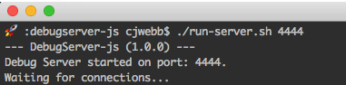

.. _started:

===============
Getting Started
===============

Prerequisites
=============
You will need to have `Code Composer Studio`_ installed along with drivers
for any devices you plan to use (offered during installation of CCS or
available in CCS’s Resource Explorer).

Install
=======

::

    git clone https://github.com/webbcam/debugserver-js.git

Configure
=========

Open the file: ``run-server.sh`` and modify the ``CCS_EXE_PATH`` variable to
reflect your machine and CCS installation location.

Running
=======

Open a terminal and run the ``run-server.sh`` script. Once running you can leave
this terminal running in the background while you connect to it th

Mac OS
------

::

    ./run-server.sh 4444

Linux
-----

::

    ./run-server.sh 4444

Windows
-------

.. External Links
.. _Debug Server Scripting: http://software-dl.ti.com/ccs/esd/documents/users_guide/sdto_dss_handbook.html
.. _Code Composer Studio: http://www.ti.com/tool/CCSTUDIO
.. _Test Server: http://software-dl.ti.com/ccs/esd/documents/users_guide/sdto_dss_handbook.html#examples

